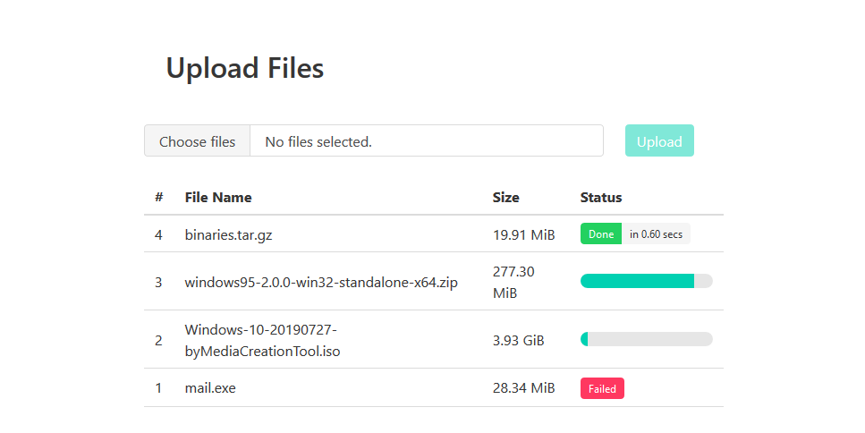

# InTray

InTray 📥 is a lightweight and simplistic CLI tool with a clean Web UI to facilitate collecting files over HTTP.

Written in Rust and powered by the succinct web framework tide, InTray has reasonable performance and decent concurrency support. It provides nothing other than receiving upload, but with great convenience and reliability.

It can be an alternative to `python -m pyftpdlib`, even though it does not cover all usage scenarios of the latter.

## Install
`cargo install intray`

*TODO: Instructions on downloading from releases*

## Interface

### Server
```
intray [OPTIONS] [PORT]

FLAGS:
    -h, --help       Prints help information
    -V, --version    Prints version information

OPTIONS:
    -d, --dir <dir>            Directory to store received files [default: ./]
    -a, --ip-addr <ip_addr>    IP address to bind on [default: ::]

ARGS:
    <PORT>    Port to bind on [default: 8080]
```

### Upload with curl

**Upload without name**

`curl -X post --data-binary @FILENAME http://HOSTNAME:PORT/upload/full`

**Upload with name**

`curl -X post --data-binary @FILENAME http://HOSTNAME:PORT/upload/full/filename`

### Web UI


## TODO
- [x] Rewrite with tide (deprecating the original actix-web version).
- [x] Rewrite Web UI (#1).
- [ ] Authentication.
- [ ] Support HTTPS without the need to setup Web server separatedly.
- [ ] Support to limit space usage.
- [ ] Upgrade tokio{,-fs} to 0.2 (still in alpha).